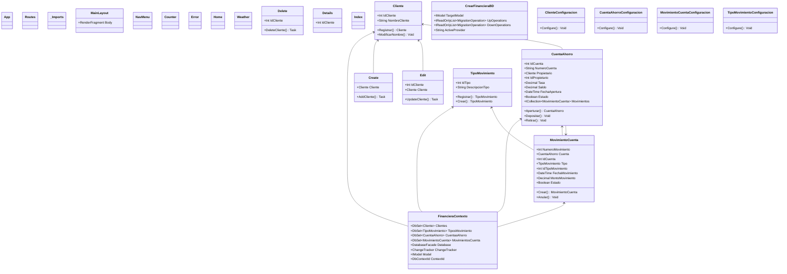

```mermaid
classDiagram

class FinancieraContexto
FinancieraContexto : +DbSet~Cliente~ Clientes
FinancieraContexto : +DbSet~TipoMovimiento~ TiposMovimiento
FinancieraContexto : +DbSet~CuentaAhorro~ CuentasAhorro
FinancieraContexto : +DbSet~MovimientoCuenta~ MovimientosCuenta
FinancieraContexto : +DatabaseFacade Database
FinancieraContexto : +ChangeTracker ChangeTracker
FinancieraContexto : +IModel Model
FinancieraContexto : +DbContextId ContextId

class App

class Routes

class _Imports

class MainLayout
MainLayout : +RenderFragment Body

class NavMenu

class Counter

class Error

class Home

class Weather

class Create
Create : +Cliente Cliente
Create : +AddCliente() Task

class Delete
Delete : +Int IdCliente
Delete : +DeleteCliente() Task

class Details
Details : +Int IdCliente

class Edit
Edit : +Int IdCliente
Edit : +Cliente Cliente
Edit : +UpdateCliente() Task

class Index

class Cliente
Cliente : +Int IdCliente
Cliente : +String NombreCliente
Cliente : +Registrar() Cliente
Cliente : +ModificarNombre() Void

class CuentaAhorro
CuentaAhorro : +Int IdCuenta
CuentaAhorro : +String NumeroCuenta
CuentaAhorro : +Cliente Propietario
CuentaAhorro : +Int IdPropietario
CuentaAhorro : +Decimal Tasa
CuentaAhorro : +Decimal Saldo
CuentaAhorro : +DateTime FechaApertura
CuentaAhorro : +Boolean Estado
CuentaAhorro : +ICollection~MovimientoCuenta~ Movimientos
CuentaAhorro : +Aperturar() CuentaAhorro
CuentaAhorro : +Depositar() Void
CuentaAhorro : +Retirar() Void

class MovimientoCuenta
MovimientoCuenta : +Int NumeroMovimiento
MovimientoCuenta : +CuentaAhorro Cuenta
MovimientoCuenta : +Int IdCuenta
MovimientoCuenta : +TipoMovimiento Tipo
MovimientoCuenta : +Int IdTipoMovimiento
MovimientoCuenta : +DateTime FechaMovimiento
MovimientoCuenta : +Decimal MontoMovimiento
MovimientoCuenta : +Boolean Estado
MovimientoCuenta : +Crear() MovimientoCuenta
MovimientoCuenta : +Anular() Void

class TipoMovimiento
TipoMovimiento : +Int IdTipo
TipoMovimiento : +String DescripcionTipo
TipoMovimiento : +Registrar() TipoMovimiento
TipoMovimiento : +Crear() TipoMovimiento

class CrearFinancieraBD
CrearFinancieraBD : +IModel TargetModel
CrearFinancieraBD : +IReadOnlyList~MigrationOperation~ UpOperations
CrearFinancieraBD : +IReadOnlyList~MigrationOperation~ DownOperations
CrearFinancieraBD : +String ActiveProvider

class ClienteConfiguracion
ClienteConfiguracion : +Configure() Void

class CuentaAhorroConfiguracion
CuentaAhorroConfiguracion : +Configure() Void

class MovimientoCuentaConfiguracion
MovimientoCuentaConfiguracion : +Configure() Void

class TipoMovimientoConfiguracion
TipoMovimientoConfiguracion : +Configure() Void


Cliente <-- FinancieraContexto
TipoMovimiento <-- FinancieraContexto
CuentaAhorro <-- FinancieraContexto
MovimientoCuenta <-- FinancieraContexto
Cliente <-- Create
Cliente <-- Edit
Cliente <-- CuentaAhorro
MovimientoCuenta <-- CuentaAhorro
CuentaAhorro <-- MovimientoCuenta
TipoMovimiento <-- MovimientoCuenta

```
